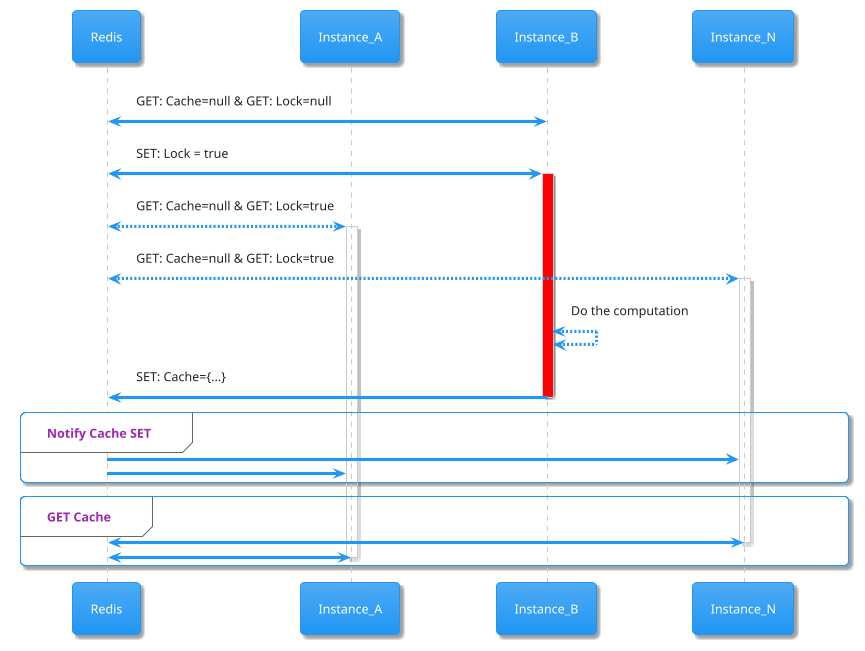

<p align="center">
<a href="https://codecov.io/gh/pysergio/atomcache"> 
  
</a>
<a href="https://pypi.org/project/atomcache" target="_blank">
    
</a>
<a href="https://pypi.org/project/atomcache" target="_blank">
    
</a>
</p>

## Introduction
Asynchronous cache manager designed for horizontally scaled web applications.
**NOTE:** _Currently has implementation only for FastAPI using Redis._

## Requirements

Python 3.7+

* <a href="https://aioredis.readthedocs.io" class="external-link" target="_blank">aioredis</a> for cache implementation.
* <a href="https://fastapi.tiangolo.com" class="external-link" target="_blank">FastAPI</a> for the web parts.
  
## Installation

<div class="termy">

```console
$ pip install atomcache

---> 100%
```

## Explanation schema


<details markdown="1">
<summary>As UML</summary>


</details>

## Examples:

### Usage as FastAPI Dependency

* Create a file `events.py` with:

```Python
from typing import Optional, Callable

import aioredis
from fastapi import FastAPI, Depends
from atomcache import Cache


def create_start_app_handler(app: FastAPI) -> Callable:
    async def start_app() -> None:
        redis: aioredis.Redis = await aioredis.from_url(url="redis://localhost", encoding="utf-8")
        await Cache.init(app, redis)

    return start_app


def create_stop_app_handler(app: FastAPI) -> Callable:
    async def stop_app() -> None:
        await Cache.backend.close()

    return stop_app
```

* Create a file `main.py` with:

```Python
from typing import Optional

from fastapi import FastAPI, Depends
from atomcache import Cache

from .events import create_start_app_handler, create_stop_app_handler

app = FastAPI()

app.add_event_handler("startup", create_start_app_handler(app))
app.add_event_handler("shutdown", create_stop_app_handler(app))


@router.get("/resources", response_model=List[TheResponseModel], name="main:test-example")
async def resources(offset: int = 0, items: int = 10, cache: Cache = Depends(Cache(exp=600)):
    cache_id = f"{offset}-{items}"  # Build cache identifier
    await cache.raise_try(cache_id)  # Try to respond from cache
    response = await db.find(TheResponseModel, skip=offset, limit=items)
    await asyncio.sleep(10)  # Do some heavy work for 10 sec, see `lock_timeout`
    return cache.set(response, cache_id=cache_id)
```

### Direct cache usage for avoiding repetitive calling on external resources:

```Python
from aiohttp import ClientSession
from atomcache import Cache

cache = Cache(exp=1200, namespace="my-namespace:")


async def requesting_helper(ref: str) -> List[dict]:
    cached_value = await cache.get(cache_id=ref)
    if cached_value is not None:
        return cached_value

    async with ClientSession() as session:
        async with session.get(f"https://external-api.io/{ref}") as response:
            if response.ok:
                cached_value = response.json()
                return cache.set(cached_value, cache_id=ref)
    return []
```
